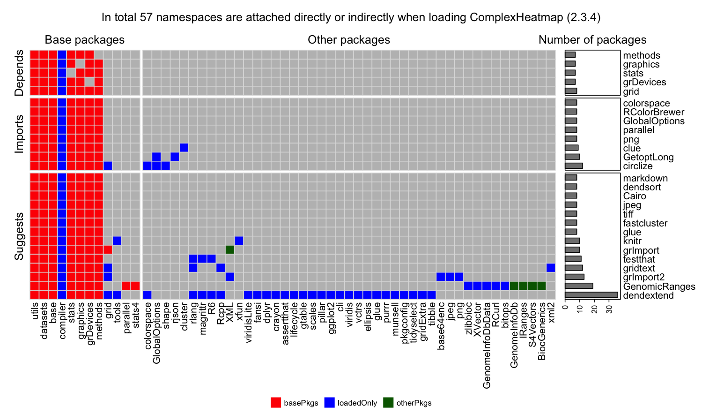

When developing R packages, we should try to avoid directly setting
dependencies to "heavy packages". The "heaviness" for a package means, the
number of additional dependent packages it brings to. If your package directly depends
on a heavy package, it brings several consequences:

1. Users need to install a lot of additional packages if your
   package is installed (which brings the risk that installation of some packages
   may fail that makes your package cannot be installed neither). 
2. The namespaces that are loaded into your R session after loading your package (by
   `library(your-pkg)`) will be huge (you can see the loaded namespaces by `sessionInfo()`).

You package will be "heavy" as well and it may take long time to load your
package.

In the DESCRIPTION file of your package, those "directly dependent pakcages"
are always listed in the "Depends" or "Imports" fields. To get rid of the heavy
packages that are not offen used in your package, it is better to move them
into the "Suggests" fields and load them only when they are needed.

Here **pkgndep** package checks the heaviness of the packages that your
package depends on. For each package listed in the "Depends", "Imports" and
"Suggests" fields in the DESCRIPTION file, it opens a new R session, loads the
package and counts the number of namespaces that are loaded. The summary of
the dependencies is visualized by a customized heatmap.

As an example, I am developing a package 
[**cola**](https://jokergoo.github.com/cola) which depends on [a lot of other
packages](https://github.com/jokergoo/ComplexHeatmap/blob/master/DESCRIPTION).
The dependency heatmap looks like ([Figure in the original size is here](https://jokergoo.github.io/pkgndep/stat/image/cola.png)):

<p></p>

In the heatmap, rows are the packages listed in "Depends", "Imports" and "Suggests" fields,
columns are the namespaces that are loaded if each of the package is only loaded to a new R session.
The barplots on the right show the number of namespaces that are imported by each package.

We can see if all the packages are put in the "Imports" field, 166 namespaces
will be loaded after `library(cola)`. Some of the heavy packages such as
**WGCNA** and **clusterProfiler** are not very frequently used in **cola**,
moving them to "Suggests" field and loading them only when they are needed
helps to speed up loading **cola**. Now the number of namespaces are reduced
to only 25 after `library(cola)`.

## Usage

To use this package:

```r
library(pkgndep)
x = pkgndep("package-name")
plot(x)
```

or

```r
x = pkgndep("path-to-the-package")
plot(x)
```

An executable example:

```r
library(pkgndep)
x = pkgndep("ComplexHeatmap")
# ========== checking ComplexHeatmap ==========
# Loading methods to a new R session... 7 namespaces loaded.
# Loading grid to a new R session... 8 namespaces loaded.
# Loading graphics to a new R session... 7 namespaces loaded.
# Loading stats to a new R session... 7 namespaces loaded.
# Loading grDevices to a new R session... 7 namespaces loaded.
# Loading circlize to a new R session... 12 namespaces loaded.
# Loading GetoptLong to a new R session... 10 namespaces loaded.
# Loading colorspace to a new R session... 8 namespaces loaded.
# Loading clue to a new R session... 9 namespaces loaded.
# Loading RColorBrewer to a new R session... 8 namespaces loaded.
# Loading GlobalOptions to a new R session... 8 namespaces loaded.
# Loading parallel to a new R session... 8 namespaces loaded.
# Loading png to a new R session... 8 namespaces loaded.
# Loading testthat to a new R session... 11 namespaces loaded.
# Loading knitr to a new R session... 10 namespaces loaded.
# Loading markdown to a new R session... 8 namespaces loaded.
# Loading dendsort to a new R session... 8 namespaces loaded.
# Loading Cairo to a new R session... 8 namespaces loaded.
# Loading jpeg to a new R session... 8 namespaces loaded.
# Loading tiff to a new R session... 8 namespaces loaded.
# Loading fastcluster to a new R session... 8 namespaces loaded.
# Loading dendextend to a new R session... 36 namespaces loaded.
# Loading grImport to a new R session... 10 namespaces loaded.
# Loading grImport2 to a new R session... 13 namespaces loaded.
# Loading glue to a new R session... 8 namespaces loaded.
# Loading GenomicRanges to a new R session... 19 namespaces loaded.
# Loading gridtext to a new R session... 12 namespaces loaded.
x
# ComplexHeatmap version 2.3.4
# 14 namespaces loaded if only load packages in Depends and Imports
# 57 namespaces loaded after loading all packages in Depends, Imports and Suggests
plot(x)
```

<p></p>


## Statistics

I ran **pkgndep** on all packages that are installed in my computer. The table
of the number of loaded namespaces as well as the dependency heatmaps are
available at https://jokergoo.github.io/pkgndep/stat/.

For a quick look, the top 10 packages with the largest dependencies are:

|Package                                       | # Namespaces| also load packages in Suggests|                                                                                                 Heatmap|
|:---------------------------------------------|------------:|------------------------------:|-------------------------------------------------------------------------------------------------------:|
|ReportingTools                                |          125|                            131|                                [view](https://jokergoo.github.io/pkgndep/stat/image/ReportingTools.png)|
|TCGAbiolinks                                  |          118|                            209|                                  [view](https://jokergoo.github.io/pkgndep/stat/image/TCGAbiolinks.png)|
|epik                                          |          116|                            116|                                          [view](https://jokergoo.github.io/pkgndep/stat/image/epik.png)|
|minfiData                                     |          109|                            109|                                     [view](https://jokergoo.github.io/pkgndep/stat/image/minfiData.png)|
|minfiDataEPIC                                 |          109|                            109|                                 [view](https://jokergoo.github.io/pkgndep/stat/image/minfiDataEPIC.png)|
|ggbio                                         |          108|                            119|                                         [view](https://jokergoo.github.io/pkgndep/stat/image/ggbio.png)|
|FlowSorted.Blood.450k                         |          108|                            108|                         [view](https://jokergoo.github.io/pkgndep/stat/image/FlowSorted.Blood.450k.png)|
|IlluminaHumanMethylation450kanno.ilmn12.hg19  |          108|                            108|  [view](https://jokergoo.github.io/pkgndep/stat/image/IlluminaHumanMethylation450kanno.ilmn12.hg19.png)|
|IlluminaHumanMethylation450kmanifest          |          108|                            108|          [view](https://jokergoo.github.io/pkgndep/stat/image/IlluminaHumanMethylation450kmanifest.png)|
|IlluminaHumanMethylationEPICanno.ilm10b2.hg19 |          108|                            108| [view](https://jokergoo.github.io/pkgndep/stat/image/IlluminaHumanMethylationEPICanno.ilm10b2.hg19.png)|

And the top 10 packages with the largest dependencies where packages in "Suggests" are also loaded are:

|Package        | # Namespaces| also load packages in Suggests|                                                                  Heatmap|
|:--------------|------------:|------------------------------:|------------------------------------------------------------------------:|
|TCGAbiolinks   |          118|                            209|   [view](https://jokergoo.github.io/pkgndep/stat/image/TCGAbiolinks.png)|
|cola           |           25|                            174|           [view](https://jokergoo.github.io/pkgndep/stat/image/cola.png)|
|broom          |           29|                            171|          [view](https://jokergoo.github.io/pkgndep/stat/image/broom.png)|
|GSEABase       |           29|                            135|       [view](https://jokergoo.github.io/pkgndep/stat/image/GSEABase.png)|
|sesame         |           73|                            134|         [view](https://jokergoo.github.io/pkgndep/stat/image/sesame.png)|
|ReportingTools |          125|                            131| [view](https://jokergoo.github.io/pkgndep/stat/image/ReportingTools.png)|
|GenomicRanges  |           17|                            128|  [view](https://jokergoo.github.io/pkgndep/stat/image/GenomicRanges.png)|
|ensembldb      |           57|                            126|      [view](https://jokergoo.github.io/pkgndep/stat/image/ensembldb.png)|
|AER            |           36|                            126|            [view](https://jokergoo.github.io/pkgndep/stat/image/AER.png)|
|BiocGenerics   |            8|                            125|   [view](https://jokergoo.github.io/pkgndep/stat/image/BiocGenerics.png)|
